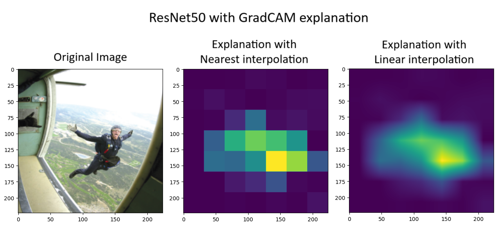

# Random notes

## GradCAM output size

Implementation found in [pytorch-grad-cam](https://github.com/jacobgil/pytorch-grad-cam/tree/master) library automatically scales the explanation to the input size. This is useful for comparing explanations of different models as each explanation will have the same size. 

However, interpolation used for scaling is *cv.INTER_LINEAR* and it nicely smoothes the outcomes. Originally, *cv.INTER_NEAREST* should be used to preserve the original values but this produces a very pixelated image for example for ResNet50 with only 7x7 output size.

To change it, modify the following line in [*pytorch_grad_cam\utils\image.py*](https://github.com/jacobgil/pytorch-grad-cam/blob/master/pytorch_grad_cam/base_cam.py#L144) in *scale_cam_image(...)* function:
> img = cv2.resize(img, target_size)

into:
> img = cv2.resize(img, target_size, interpolation=cv2.INTER_NEAREST)

**Random conclusion** - explanations of models of different architectures will be visibly different due to different original explanation sizes. 
