# Results

Here I document all experiments.

### ToC:

- [20240410-gradcam-256](#20240410-gradcam-256)
- [20240410-gradcam-1024](#20240410-gradcam-1024)
- [20240410-kernelshap-64](#20240410-kernelshap-64)
- [20240414-1-2x2-pca-comparison](#20240414-1-2x2-pca-comparison)
- [20240414-2-gradcam-1024-fixed-efficientnet-b4](#20240414-2-gradcam-1024-fixed-efficientnet-b4)
- [20240414-3-2x2-pca-comparison-fixed-efficientnet-b4](#20240414-3-2x2-pca-comparison-fixed-efficientnet-b4)
- [20240417-gradcam-256-only-same-prediction](#20240417-gradcam-256-only-same-prediction)
- [20240421-fixing-kernelshap](#20240421-fixing-kernelshap)
- [20240505-finetuned-gradcam-256-ig-64-kernelshap-64](#20240505-finetuned-gradcam-256-ig-64-kernelshap-64)
- [20240519-print-gradcam-resolutions](#20240519-print-gradcam-resolutions)
- [20240521-compare-kernelshap-steps](#20240521-compare-kernelshap-steps)
- [20240531-accuracy-not-resized](#20240531-accuracy-not-resized)
- [20240603-gradcam-512-histograms-clustering](#20240603-gradcam-512-histograms-clustering)
- [20240613-sample-explanations-kernelshap-ig](#20240613-sample-explanations-kernelshap-ig)
- [20240616-adding-stdev-to-metric](#20240616-adding-stdev-to-metric)
- [20240618-visualizations](#20240618-visualizations)
- [20240620-gradcam-kernelshap-ig-128](#20240620-gradcam-kernelshap-ig-128)
- [20240704-integratedgradients-abs-value](#20240704-integratedgradients-abs-value)
- [20240716-visualizations-of-explanations](#20240716-visualizations-of-explanations)
- [20240806-influence-of-images-count](#20240806-influence-of-images-count)
- [20240809-deeper-explanations](#20240809-deeper-explanations)
- [20240831-update-hierarchical-clust-metric](#20240831-update-hierarchical-clust-metric)
- [20240903-count-different-pairs](#20240903-count-different-pairs)

## 20240410-gradcam-256

Settings:
- Models: ['DeiT_S', 'DeiT_T', 'DenseNet121', 'EfficientNet_B3', 'EfficientNet_B4', 'ConvNeXtV2_Nano', 'PyramidViT_V2_B2', 'MobileNetV3', 'Swin_T', 'ResNet18', 'ResNet50', 'ResNeXt50', 'Res2Net50', 'ViT_B_32']
- Method: GradCAM
- Images: 16 batches by 16 images, 256 total

Took 150s with T4 Colab GPU.

Results:

Cosine similarity + PCA | RBF similarity + PCA
:-------------------------:|:-------------------------:
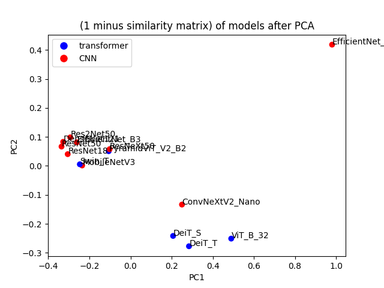  |  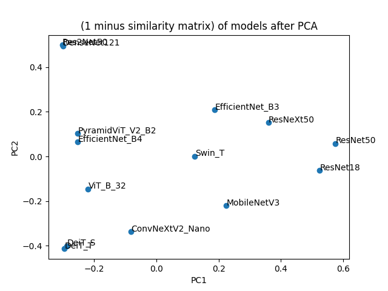

Clusters:
- DenseNet121, EfficientNet_B3, PyramidViT_V2_B2, MobileNetV3, Swin_T, ResNet18, ResNet50, ResNeXt50, Res2Net50,
- ConvNeXtV2_Nano, DeiT_S, DeiT_T, ViT_B_32,
- EfficientNet_B4 

Note: EfficientNet_B4 behaves strangely - almost all explanations highlight top right corner. Could be somewhat fixed by replacing it with an average. See below for a visualized example of this bug.

## 20240410-gradcam-1024

Settings:
- Models: ['DeiT_S', 'DeiT_T', 'DenseNet121', 'EfficientNet_B3', 'EfficientNet_B4', 'ConvNeXtV2_Nano', 'PyramidViT_V2_B2', 'MobileNetV3', 'Swin_T', 'ResNet18', 'ResNet50', 'ResNeXt50', 'Res2Net50', 'ViT_B_32']
- Method: GradCAM
- Images: 32 batches by 32 images, 1024 total

Took 520s with T4 Colab GPU.

Results:

Cosine similarity + PCA | RBF similarity + PCA
:-------------------------:|:-------------------------:
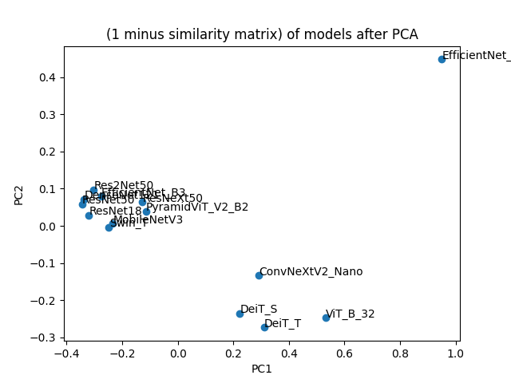  |  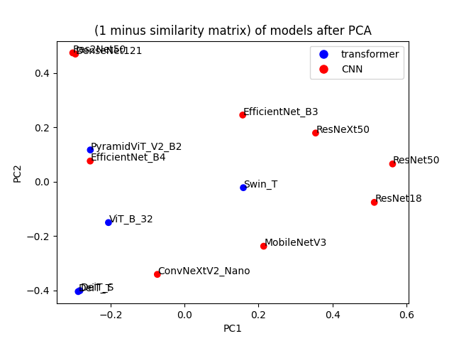

Clusters - Same as 20240410-gradcam-256 (for 256 instead of 1024 analyzed images).

Note: EfficientNet_B4 behaves strangely - same as above, almost all explanations highlight top right corner. Could be somewhat fixed by replacing it with an average.

Good - some CNN (EfficientNet_B3) | Bad - EfficientNet_B4 (CNN)
:-------------------------:|:-------------------------:
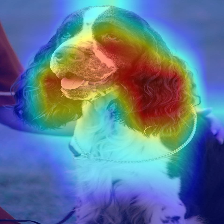  |  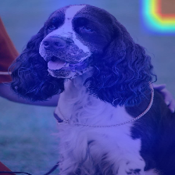

## 20240410-kernelshap-64

Settings:
- Models: ['DeiT_S', 'DeiT_T', 'DenseNet121', 'EfficientNet_B3', 'EfficientNet_B4', 'ConvNeXtV2_Nano', 'PyramidViT_V2_B2', 'MobileNetV3', 'Swin_T', 'ResNet18', 'ResNet50', 'ResNeXt50', 'Res2Net50', 'ViT_B_32']
- Method: KernelSHAP
- Images: 4 batches by 16 images, 64 total

Took 1550s with T4 Colab GPU.

Results:

Cosine similarity + PCA | RBF similarity + PCA
:-------------------------:|:-------------------------:
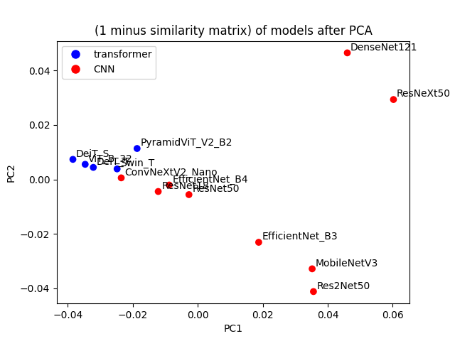  |  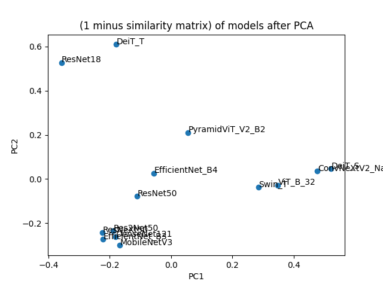

Clusters:
- ConvNeXtV2_Nano, DeiT_S, DeiT_T, EfficientNet_B4, PyramidViT_V2_B2, Swin_T, ResNet18, Res2Net50, ViT_B_32,
- EfficientNet_B3, MobileNetV3, ResNet50
- DenseNet121, ResNeXt50

Note: Explanations generally look bland. Possibly, changing KernelSHAP settings (64 segments and sampled 100 times) to increase how many times the superpixels are sampled, would improve the results. Obviously, segmentation is not perfect too and is an additional variable.

Good explanation | Bad explanation
:-------------------------:|:-------------------------:
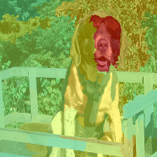  |  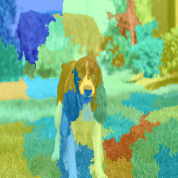

## 20240414-1-2x2-pca-comparison

Take PCA plots from `20240410-gradcam-1024` and `20240410-kernelshap-64` for cosine and RBF similarity and plot them side by side:

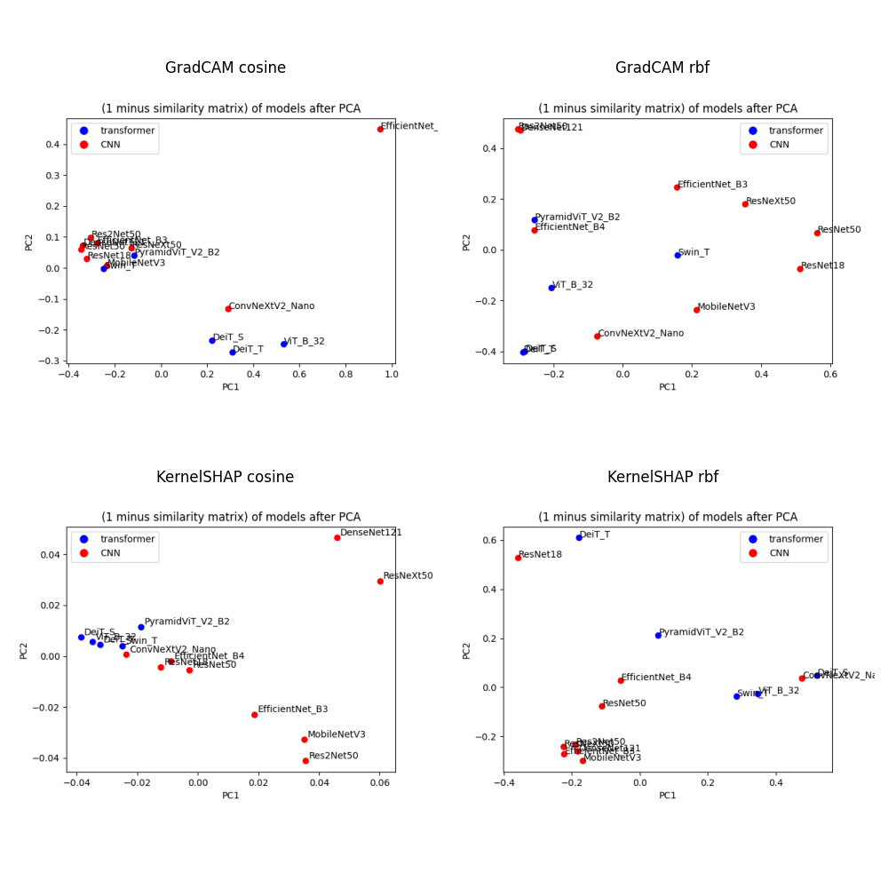

## 20240414-2-gradcam-1024-fixed-efficientnet-b4

Settings - rerun `20240410-gradcam-1024` for EfficientNet_B4 only after fix.

Fix: replace top-right corner with an average of other pixels.

Results: extreme value from top-right corner has been removed for all explanations -> 

Before fix | After fix
:-------------------------:|:-------------------------:
 | 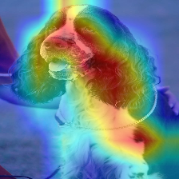

## 20240414-3-2x2-pca-comparison-fixed-efficientnet-b4

Goal: repeat `20240414-1-2x2-pca-comparison` with fixed EfficientNet_B4.

Note: only GradCAM PCA plots were recomputed.

## 20240417-gradcam-256-only-same-prediction

Goal: 

- count the number of images on which a given pair of models gave the same prediction (not necessarily correct, but the same),
- compute similarity matrices for cosine and rbf but using only images for which a given pair of models gave the same prediction,
- compute similarity between this matrix of counts of same predictions and all similarity matrices from earlier.

Setting:

- as in `20240410-gradcam-256`, but for 8 batches of 32 images, same 256 total.

Took 300s with T4 GPU on Colab.

### Results:

Correlations between a matrix of count of same predictions and different similarity matrices (rbf/cosine and using [all/only matching] predictions):

|               | All images | Only matching predictions |
|---------------|------------|---------------------------|
| Cosine        | 0.695880   | 0.672233                  |
| RBF           | 0.642113   | 0.641272                  |

Counts heatmap: 

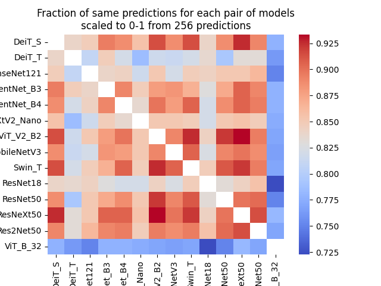

Similarity matrices that it was compared to:

|               | All images | Only images with matching prediction |
|---------------|--------|-----|
| Cosine        | 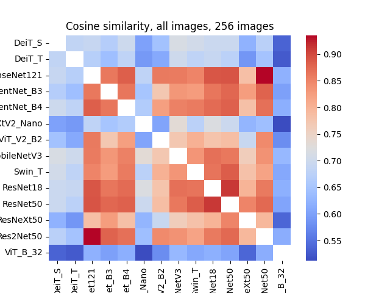 | 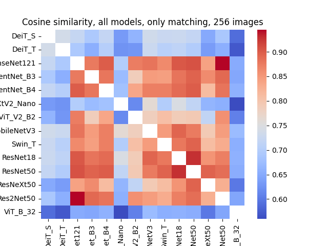 |
| RBF           | 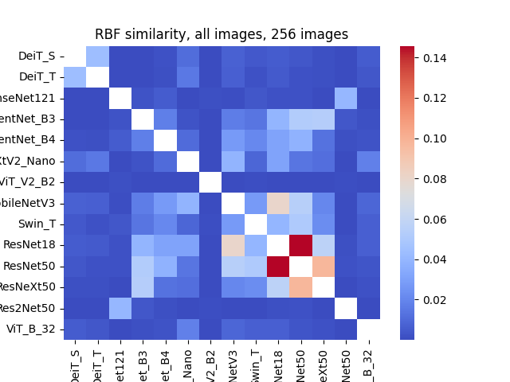 |  |

PCA obtained for these similarity matrices:

|               | All images | Only images with matching prediction |
|---------------|--------|-----|
| Cosine        | 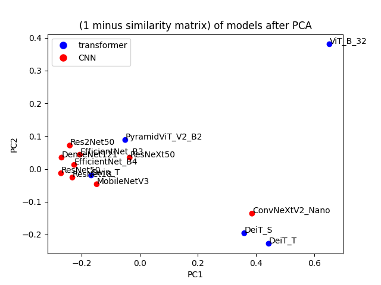 | 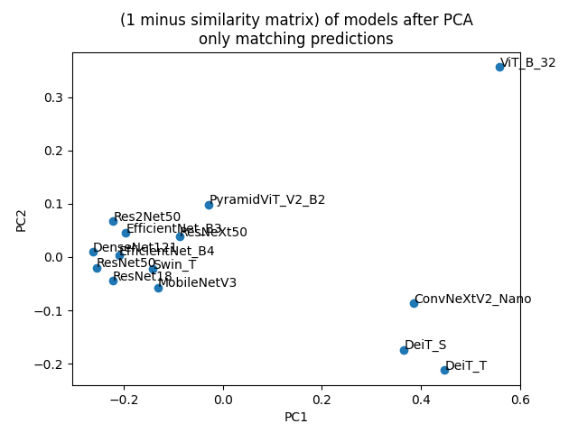 |
| RBF           |  | 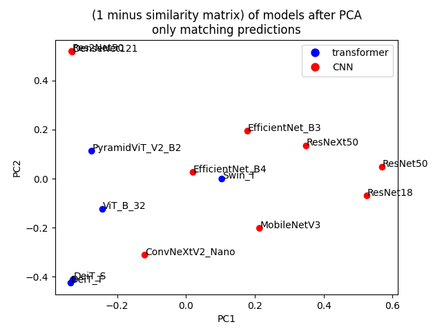 |

## 20240421-fixing-kernelshap

Goal: Change KernelSHAP settings to improve the quality of explanations.

Settings:

Before: 64 segments and sampled 100 times. New: 50 segments and sampled 100 times. Reason: In my Bsc thesis we based on KernelSHAP with 50 segments and sampled 50 times by default, so possibly here it should also work. Also, changed the way explanations are computed: one image at a time, not in batches.

Results: Not much improvement. Possibly, further increasing the number of samples would help. Also, segmentation is not perfect and has some influence.

|               | Before | After |
|---------------|--------|-------|
| ConvNeXtV2_Nano - little change | 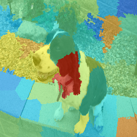 | 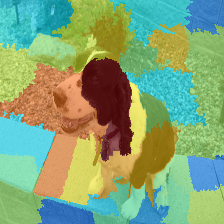 |
| ConvNeXtV2_Nano - slight change | 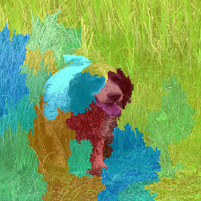 | 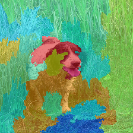 |
| ResNet18      | 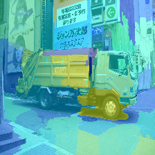 | 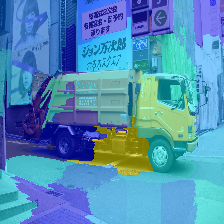 |
| ResNet18      | 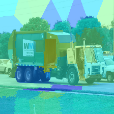 | 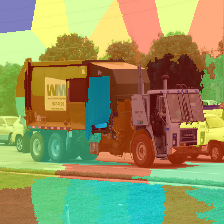 |

## 20240505-finetuned-gradcam-256-ig-64-kernelshap-64

Goal: Add new explanation method (Integrated Gradients) and finetune models on Imagenette2 and see if the results are better. 

Settings: 
- use `timm` and finetune each models with `vision_learner.fine_tune` for 1 epoch. 
- compute explanations for all of the models and 3 explanation methods. If no fintuned model was available, the original model was used (pretrained on Imagenet).
- Computed explanations for 256 images with GradCAM and for 64 for KernelSHAP and Integrated Gradients.
- Integrated Gradients was set with a default hyperparameter value of 50 steps.

### Finetuning results:

- funetuning took up to 5 minutes per model on Colab with T4 GPU,
- accuracies of models are around 97%-99% on Imagenette2,
- some models failed to finetune due to timm and fastai errors (MobileNetV3 and Swin_T),
- explanations for GradCAM are almost the same. For KernelSHAP they look different but neither better nor worse.

| Model | Before | After |
|---|---|---|
| ResNet18 | 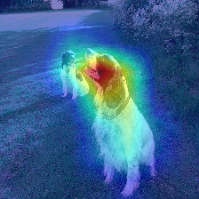 | 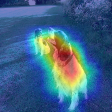 |
| ConvNeXtV2_Nano |  | 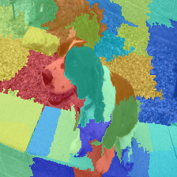 |

### Integrated Gradients

Sample explanations:
| ResNet18 | EfficientNet_B3 | ViT_B_32 |
|---|---|---|
| 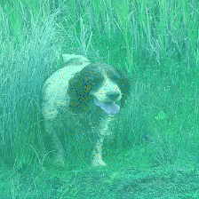 | 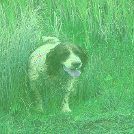 | 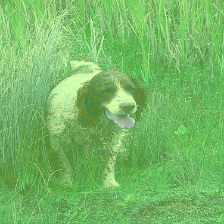 |

Comment: Integrated Gradients look best without background image. In general, they are single-pixel dots, here visible in the first 2 explanations as small artefacts on the dog head or body.

### Similarities between models

For cosine similarity:

| Explanation | All images | Only matching predictions |
|---|---|---|
| KernelSHAP | 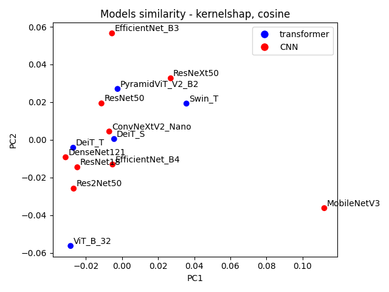 | 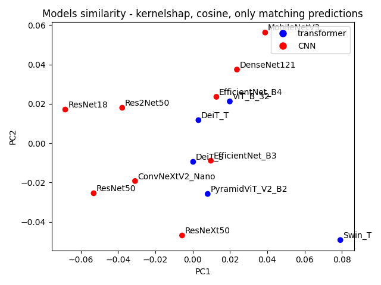 |
| Integrated Gradients | 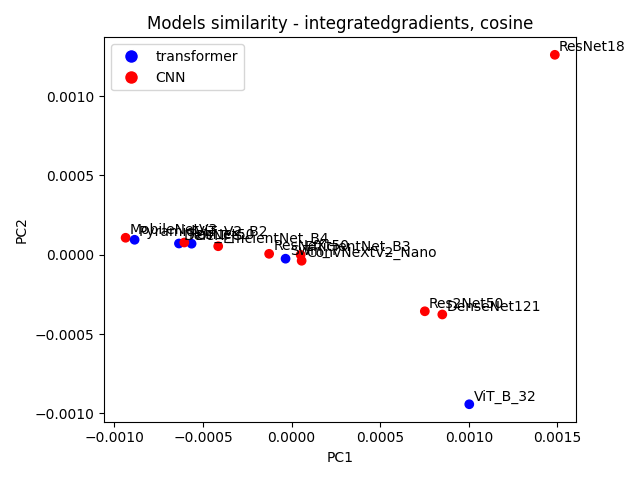 | 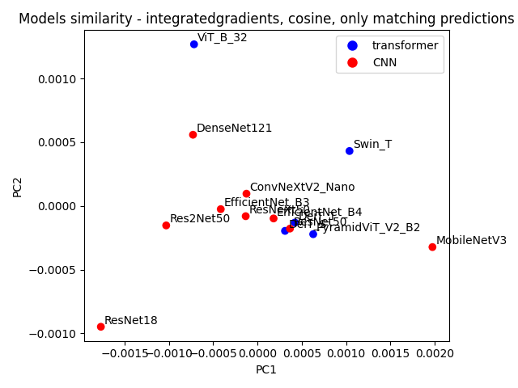 |
| GradCAM | 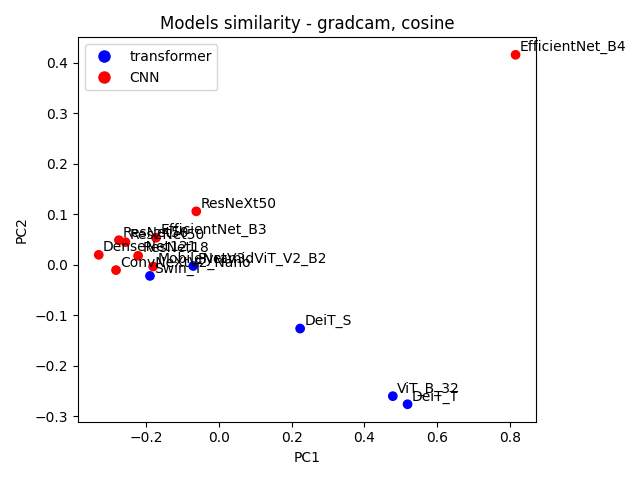 | 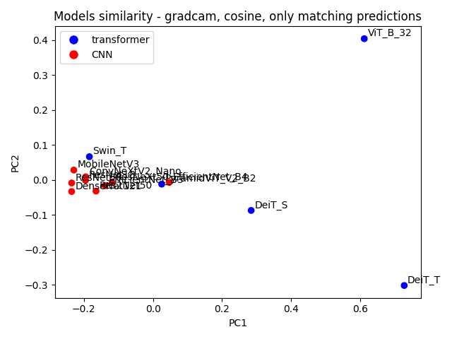 |

For RBF similarity:

| Explanation | All images | Only matching predictions |
|---|---|---|
| KernelSHAP | 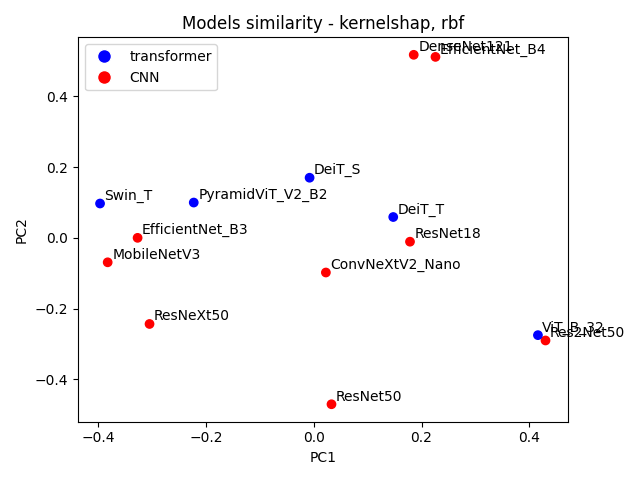 | 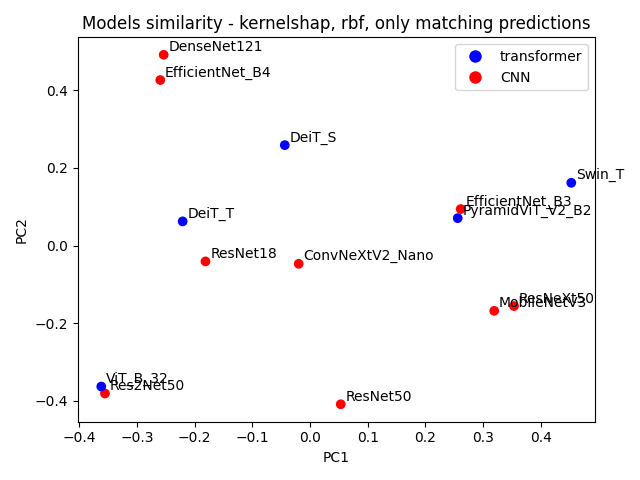 |
| Integrated Gradients | 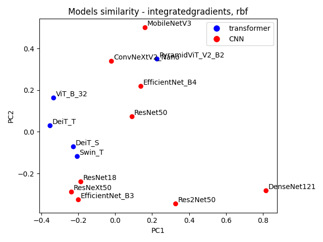 | 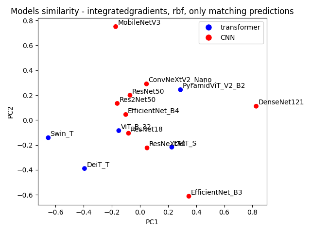 |
| GradCAM | 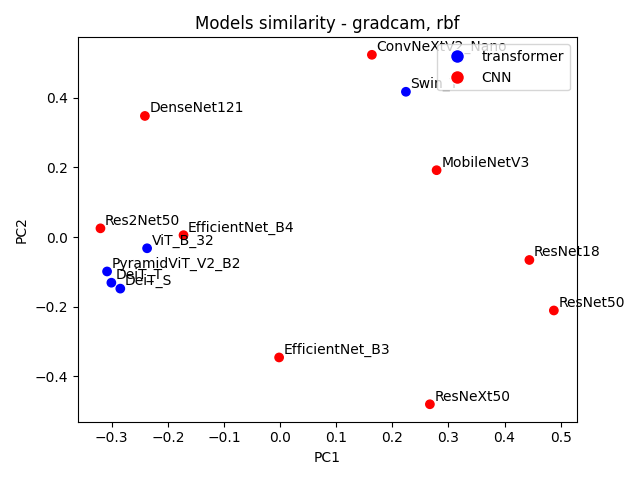 | 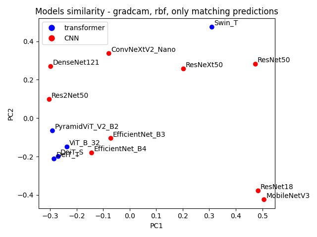 |

### Comments

- Similarity of models after applying GradCAM explanation method seem to give similar PCA plots for both cosine and RBF similarity metrics.
- There is no clear similarity between PCA plots of models similarity generated with different explanation methods or metrics.

## 20240519-print-gradcam-resolutions

Goal: Get resolution of GradCAM explanations for all models.

Results:

| Model Name | Resolution |
|---|---|
| ConvNeXt V2-N | 7x7 |
| DeiT-S | 14x14 |
| DeiT-T | 14x14 |
| DenseNet121 | 7x7 |
| EfficientNet-B3 | 7x7 |
| EfficientNet-B4 | 7x7 |
| MobileNetV3 | 7x7 |
| PVTv2-B2 | 7x7 |
| ResNet18 | 7x7 |
| ResNet50 | 7x7 |
| ResNeXt50 | 7x7 |
| Res2Net50 | 7x7 |
| Swin-T | 7x7 |
| ViT-B/32 | 7x7 |

## 20240521-compare-kernelshap-steps

Goal: Compare KernelSHAP explanations for different number of steps.

Settings: image segmented into 50 superpixels. Number of steps: 50, 100, 150, 200, 250, 300, 400. Explained image is of class fish, model is ResNet18 and the image is:

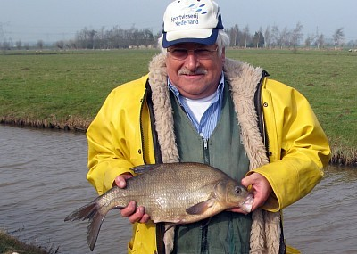

Results:

Time-wise, there is a linear increase in time with the number of steps.

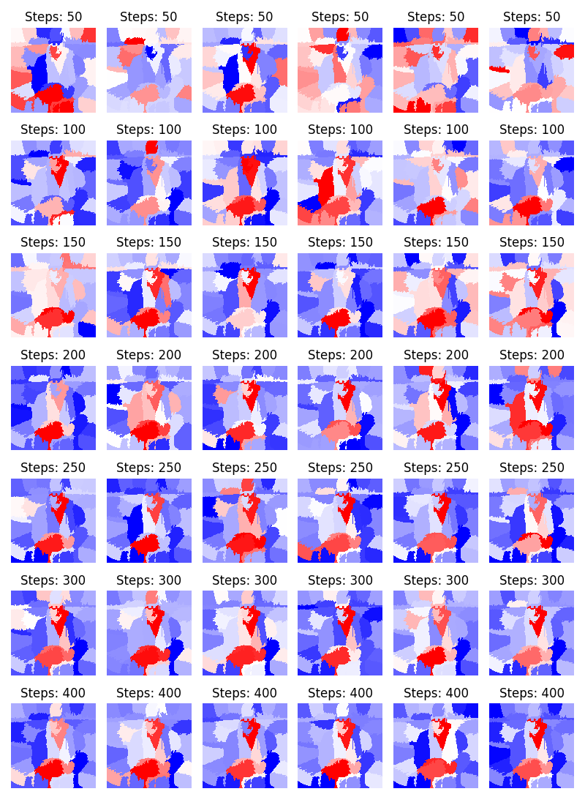

## 20240531-accuracy-not-resized

Goal: Check if using same transforms in dataloader affects models accuracy.

Setting: 
- Predict 1024 images using model-specific transforms (for all models).
- Predict 1024 images using same transforms for all models - Resize straight to 224x224 and Normalize.
- Calculate the difference in accuracy.

Results:

| Imagenette2 split: train | Imagenette2 split: val |
|---|---|
| 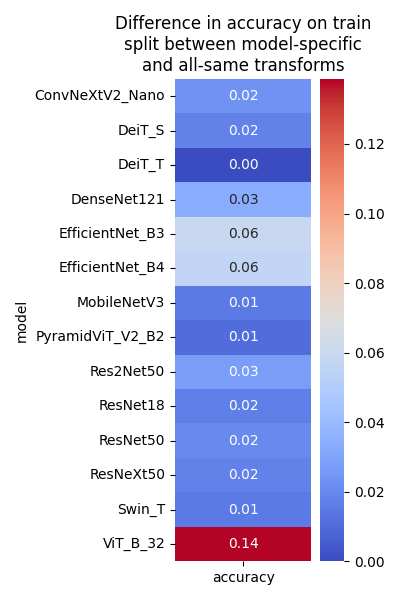 | 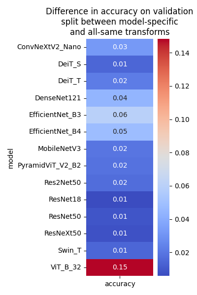 |

Explanation: Models performance drops just by a few percent. For most models, the difference is that instead of getting center-cropped 224x224 pixels, they get full 256x256 images. EfficientNet models expect slightly larger images (B3 - 288, B4 - 320) and have visibly larger drop in accuracy. However, ViT model was the only with different Normalization of the images:
- all models: `Normalize(mean=tensor([0.4850, 0.4560, 0.4060]), std=tensor([0.2290, 0.2240, 0.2250]))`
- ViT: `Normalize(mean=tensor([0.5, 0.5, 0.5]), std=tensor([0.5, 0.5, 0.5]))`

Models accuracies can be found in the `20240531-accuracy-not-resized` folder.

Further investigation:
- Take ViT model, take same common transformation as earlier (Resize to 224x224 and Normalize) and change Normalization to the model-specific one.

Results:

Accuracy difference between ViT model with model-specific transforms vs common transforms with model-specific Normalization:

| Model | Imagennete2 split: train | Imagenette2 split: val |
|---|---|---|
| ViT_B_32 | 0.03 | 0.03 |

Conclusion: The same transformations cannot be used for all models. However, CenterCrop can be ommited, and resizing images to the expected 224x224 size is ok. Normalization should be model-specific though, in particular, ViT model has to use it's normalization.

## 20240603-gradcam-512-histograms-clustering

### Part 1 - rerun GradCAM + histograms

Goal: rerun GradCAM after last fixes, create histograms of similarities between every pair of explanations.

Settings: Gradcam for 512 images, all models, cosine and RBF similarity.

Results:

| Similarity metric | Histograms |
|---|---|
| Cosine | 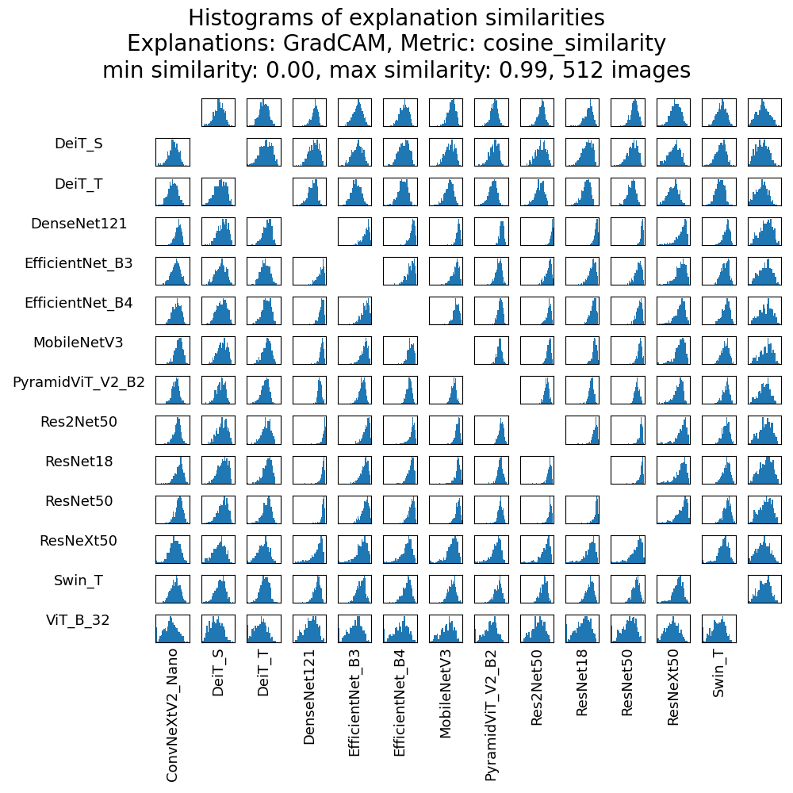 |
| RBF |  |

Histograms confirm that some models are more different than the other, with no clear distinction between CNN and transformer models.

### Part 2 - clustering

Goal: for each csv (cosine and RBF similarity) create a hierachical clustering dendrogram, PCA plot as usually and graph community detection results.

Settings: 

- Analysis i sbased on the Part 1 of the experiment. 
- Hierachical clustering colors are manually selected. 
- Graph community detection is based on the Louvain algorithm.

Results:

| Visualization method | Cosine | RBF|
|---|---|---|
| PCA |  |  |
| Hierachical clustering |  |   | 
| Graph community detection |  |  |

Conclusions: Results are similar to each other, with no clear distinction between CNN and transformer models. Visualization methods are consistent with each other. PCA is the least readable and dendrogram is the most readable. Differences in values of the metrics influence the values or shapes in the plots but not the meaning.

## 20240613-sample-explanations-kernelshap-ig

Goal: compute a few sample explanations for KernelSHAP and Integrated Gradients. Vizualize them side by side.

Settings:

- KernelSHAP: 50 segments, 350 samples,
- Integrated Gradients: 100 steps,
- include only images for which all models gave the same prediction.

Results:

| Sample image 1 | Sample image 2 | Sample image 3 | Sample image 4 |
|---|---|---|--|
|  |  |  |  |

Conclusions: 

- Quality of explanations vary between images. 
- KernelSHAP with same mask can make little sense if a tiny part of the image matters (eg. dog).
- Integrated Gradients sometimes are random for ViT/DeiT.
- Visible differences in GradCAM explanations between models.

## 20240616-adding-stdev-to-metric

Goal: Instead of relying solely on mean of similarity metric, incorporate also standard deviation.

Settings:
- to this point: a mean of similarity metric was returned
- new: return $\sqrt{(1-mean)^2 + stdev^2}$, which is a distance from (0,0) of a point with:
  - X = 1 - mean similarity = dissimilarity
  - Y = stdev of similarity

Results:

| Explanation | Histograms of values from models' similarity matrix|
|---|---|
| KernelSHAP |  |
| Integrated Gradients |  |
| GradCAM |  |

Conclusion: Values of metric are similar to each other for both cosine similarity and RBF similarity. Value 80 of scaling parameter for RBF works well for this case.

## 20240618-visualizations

### Part 1 - rerun GradCAM histograms

Goal: rerun creating histograms of similarities between every pair of GradCAM explanations.

Settings: Gradcam for 512 images, all models, cosine and RBF similarity after fixing computing similarities of a pair of images.

Results:

| Similarity metric | Histograms |
|---|---|
| Cosine |  |
| RBF |  |

No visible difference compared to the earlier version.

### Part 2 - clustering

Goal: for each csv (cosine and RBF similarity) create a hierachical clustering dendrogram, and graph community detection results.

Settings: 

- Analysis i sbased on the Part 1 of the experiment. 
- Hierachical clustering has disabled colors in dendrograms. 
- Graph community detection is based on the Louvain algorithm.

Results:

| Visualization method | Cosine | RBF|
|---|---|---|
| PCA | not used anymore | not used anymore |
| Hierachical clustering |  |   | 
| Graph community detection |  |  |

## 20240620-gradcam-kernelshap-ig-128

Goal: Compute explanations for 128 images for all models and all explanation methods. Create histograms of similarities, compute dissimilarity matrices, and try clustering with graph community detection and hierachical clustering.

Settings:

- 128 images from Imagenette2 dataset,
- GradCAM, KernelSHAP, Integrated Gradients,
- 50 segments and 350 samples for KernelSHAP,
- 100 steps for Integrated Gradients,
- results computed with no regard to the prediction of the models.

Ran on Colab with T4 GPU, took a bit over 3h with batch size 32.

Results:

Histograms of similarities:
- with Integrated Gradients and cosine similarity, histograms show values around 0 which means that images are not similar at all. 
- with Integrated Gradients and RBF similarity, histograms look fine, in the range of 0.6-0.9.
- other histograms look fine - with relatively high similarities.

Dissimilarity matrices - scales differ depending on metric and explanation method, with no common conclusion.

Clustering - After some manual tweaking of the parameter `resolution`, it is possible to match the coloring of the nodes to first/second split of the dendrogram

#### Histograms of similarities:

|  |  |  |
|---|---|---|
| GradCAM + cosine | KernelSHAP + cosine | Integrated Gradients + cosine |
|  |  |  |
| GradCAM + RBF | KernelSHAP + RBF | Integrated Gradients + RBF |
|  |  |  |

#### Dissimilarity matrices:

|  |  |  |
|---|---|---|
| GradCAM + cosine | KernelSHAP + cosine | Integrated Gradients + cosine |
|  |  |  |
| GradCAM + RBF | KernelSHAP + RBF | Integrated Gradients + RBF |
|  |  |  |

#### Clustering:

|  | Dendrogram | Graph Community Detection |
|---|---|---|
| GradCAM (Cosine) |  |  |
| GradCAM (RBF) |  |  |
| KernelSHAP (Cosine) |  |  |
| KernelSHAP (RBF) |  |  |
| Integrated Gradients (Cosine) |  |  |
| Integrated Gradients (RBF) |  |  |

## 20240704-integratedgradients-abs-value

Goal: Check results of Integrated Gradients after taking absolute values of the results.

Setting: take last experiment IG results, load explanations from numpy, take absolute value, save their copies and recompute the plots.

Results:

<!-- 2 columns - before and after called IG and IG absolute values -->
| Integrated Gradients | Integrated Gradients absolute values |
|---|---|
|  |  |
|  |  |
|  |  |
|  |  |
|  |  |
|  |  |

Conclusion: Explanations are less dissimilar meaning that they are more similar, which was to be expected as everything is non-negative now. Dendrogram for cosine is the same, for RBF differs. Histograms of similarities have moved to be more positive, and dissimilarity heatmaps have lower values.

## 20240716-visualizations-of-explanations

Goal: Visualize explanations again, for more images. Visual tweaks.

Settings: Utilize explanations computed in [20240620-gradcam-kernelshap-ig-128](#20240620-gradcam-kernelshap-ig-128) and visualize them.

Results:

Here are a few images with explanations for all models and all explanation methods:

| Sample image 1 | Sample image 2 | Sample image 3 | Sample image 4 |
|---|---|---|--|
|  |  |  |  |

Rest of the comparisons, for 60 more images, in the `20240716-visualizations-of-explanations/selected` folder.

## 20240806-influence-of-images-count

Goal: Plots comparing dissimilarity matrices computed for different number of analyzed images.

Settings: take Grad-CAM explanations from [20240806-influence-of-images-count](#20240620-gradcam-kernelshap-ig-128) and compute dissimilarity matrices for different numbers of images. Randomly sample n images 25 times, compute dissimilarity matrices for each of the subsets of n images out of 1024 total images. Then:

- compute sum of abs of differences cell by cell between dissimilarity matrices for n images and 1024 images, sums put to a boxplot,
- for each n, compute variance of values from each cell in the dissimilarity matrix and put them all in a single boxplot.

Results:

| Sum of abs differences | Variance of values |
|---|---|
|  |  |
|  |  |

## 20240809-deeper-explanations

Goal: Visualize model's behavior on a single image but at different moments with Grad-CAM.

Setting:
- take 5 models: 
  - DeiT_S, 
  - Swin_T, 
  - ResNet18, 
  - ConvNeXtV2_Nano, 
  - PyramidViT_V2_B2
- show:
  - original image
  - Integrated Gradients explanation - at the input
  - Grad-CAM explanation - at 25%, 
  - Grad-CAM explanation - at 50%, 
  - Grad-CAM explanation - at 75%, 
  - Grad-CAM explanation - at 100% of the model's depth
  - KernelSHAP explanation - at the output

Results:

10 images can be found in the `20240809-deeper-explanations` folder. Here are 4 of them:

| All predictions correct | Not all predictions correct |
|---|---|
|  |  |
|---|---|
|  |  |

## 20240831-update-hierarchical-clust-metric

Goal: change ward linkage to sth else. Compare different linkage in hierarchical clustering

Setting: According to docs https://docs.scipy.org/doc/scipy/reference/generated/scipy.cluster.hierarchy.linkage.html: 

> Methods ‘centroid’, ‘median’, and ‘ward’ are correctly defined only if Euclidean pairwise metric is used. If y is passed as precomputed pairwise distances, then it is the user’s responsibility to assure that these distances are in fact Euclidean, otherwise the produced result will be incorrect.

Tested linkage variants:
- simple (min)
- complete (max)
- average (average)
- weighted (with respect to others others)

Detailed descriptions are in the documentation linked above.

Results:

| Average | Complete | Single | Weighted | Previous Dendrograms |
|---|---|---|---|---|
|  |  |  |  |  |
|  |  |  |  |  |
|  |  |  |  |  |
|  |  |  |  |  |
|  |  |  |  |  |
|  |  |  |  |  |

Overall, all dendrograms seem random, with little similarities between them. 
- complete and ward (previously used) are most similar to each other -- probably incorrect,
- default is single -- no reason against using it,
- complete (max) is strange to think about it, min or avg sounds more reasonable,
- complete, ward and weighted are similar,
- average and single are similar.

Distance is given by the dissimilarity matrix:
- IF clusters were present, single linkage (taking min of distances between models in clusters) would work great except there aren't -> it's fine.

Conclusion: use average -- a bit more complicated than single but seems to make more sense? 

## 20240903-count-different-pairs

Goal: count how many pairs were compared in which the models have classified the image into different classes.

Settings: use 128 images from [20240620-gradcam-kernelshap-ig-128](#20240620-gradcam-kernelshap-ig-128).

Result:
- same class: 10207
- different class: 1441
