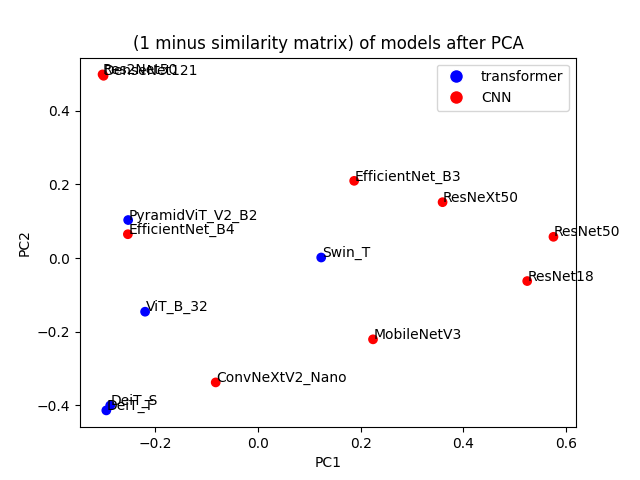
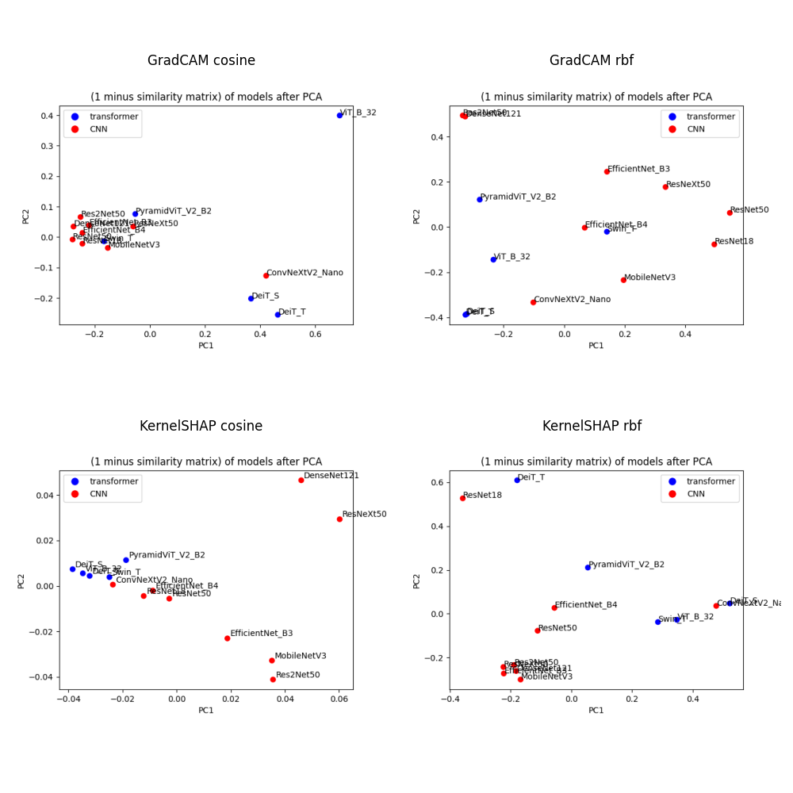

# Results

Here I document all experiments.

### ToC:

- [20240410-gradcam-256](#20240410-gradcam-256)
- [20240410-gradcam-1024](#20240410-gradcam-1024)
- [20240410-kernelshap-64](#20240410-kernelshap-64)
- [20240414-1-2x2-pca-comparison](#20240414-1-2x2-pca-comparison)
- [20240414-2-gradcam-1024-fixed-efficientnet-b4](#20240414-2-gradcam-1024-fixed-efficientnet-b4)
- [20240414-3-2x2-pca-comparison-fixed-efficientnet-b4](#20240414-3-2x2-pca-comparison-fixed-efficientnet-b4)
- [20240417-gradcam-256-only-same-prediction](#20240417-gradcam-256-only-same-prediction)
- [20240421-fixing-kernelshap](#20240421-fixing-kernelshap)
- [20240505-finetuned-gradcam-256-ig-64-kernelshap-64](#20240505-finetuned-gradcam-256-ig-64-kernelshap-64)
- [20240519-print-gradcam-resolutions](#20240519-print-gradcam-resolutions)
- [20240521-compare-kernelshap-steps](#20240521-compare-kernelshap-steps)

## 20240410-gradcam-256

Settings:
- Models: ['DeiT_S', 'DeiT_T', 'DenseNet121', 'EfficientNet_B3', 'EfficientNet_B4', 'ConvNeXtV2_Nano', 'PyramidViT_V2_B2', 'MobileNetV3', 'Swin_T', 'ResNet18', 'ResNet50', 'ResNeXt50', 'Res2Net50', 'ViT_B_32']
- Method: GradCAM
- Images: 16 batches by 16 images, 256 total

Took 150s with T4 Colab GPU.

Results:

Cosine similarity + PCA | RBF similarity + PCA
:-------------------------:|:-------------------------:
  |  

Clusters:
- DenseNet121, EfficientNet_B3, PyramidViT_V2_B2, MobileNetV3, Swin_T, ResNet18, ResNet50, ResNeXt50, Res2Net50,
- ConvNeXtV2_Nano, DeiT_S, DeiT_T, ViT_B_32,
- EfficientNet_B4 

Note: EfficientNet_B4 behaves strangely - almost all explanations highlight top right corner. Could be somewhat fixed by replacing it with an average. See below for a visualized example of this bug.

## 20240410-gradcam-1024

Settings:
- Models: ['DeiT_S', 'DeiT_T', 'DenseNet121', 'EfficientNet_B3', 'EfficientNet_B4', 'ConvNeXtV2_Nano', 'PyramidViT_V2_B2', 'MobileNetV3', 'Swin_T', 'ResNet18', 'ResNet50', 'ResNeXt50', 'Res2Net50', 'ViT_B_32']
- Method: GradCAM
- Images: 32 batches by 32 images, 1024 total

Took 520s with T4 Colab GPU.

Results:

Cosine similarity + PCA | RBF similarity + PCA
:-------------------------:|:-------------------------:
  |  

Clusters - Same as 20240410-gradcam-256 (for 256 instead of 1024 analyzed images).

Note: EfficientNet_B4 behaves strangely - same as above, almost all explanations highlight top right corner. Could be somewhat fixed by replacing it with an average.

Good - some CNN (EfficientNet_B3) | Bad - EfficientNet_B4 (CNN)
:-------------------------:|:-------------------------:
  |  

## 20240410-kernelshap-64

Settings:
- Models: ['DeiT_S', 'DeiT_T', 'DenseNet121', 'EfficientNet_B3', 'EfficientNet_B4', 'ConvNeXtV2_Nano', 'PyramidViT_V2_B2', 'MobileNetV3', 'Swin_T', 'ResNet18', 'ResNet50', 'ResNeXt50', 'Res2Net50', 'ViT_B_32']
- Method: KernelSHAP
- Images: 4 batches by 16 images, 64 total

Took 1550s with T4 Colab GPU.

Results:

Cosine similarity + PCA | RBF similarity + PCA
:-------------------------:|:-------------------------:
  |  

Clusters:
- ConvNeXtV2_Nano, DeiT_S, DeiT_T, EfficientNet_B4, PyramidViT_V2_B2, Swin_T, ResNet18, Res2Net50, ViT_B_32,
- EfficientNet_B3, MobileNetV3, ResNet50
- DenseNet121, ResNeXt50

Note: Explanations generally look bland. Possibly, changing KernelSHAP settings (64 segments and sampled 100 times) to increase how many times the superpixels are sampled, would improve the results. Obviously, segmentation is not perfect too and is an additional variable.

Good explanation | Bad explanation
:-------------------------:|:-------------------------:
  |  

## 20240414-1-2x2-pca-comparison

Take PCA plots from `20240410-gradcam-1024` and `20240410-kernelshap-64` for cosine and RBF similarity and plot them side by side:

## 20240414-2-gradcam-1024-fixed-efficientnet-b4

Settings - rerun `20240410-gradcam-1024` for EfficientNet_B4 only after fix.

Fix: replace top-right corner with an average of other pixels.

Results: extreme value from top-right corner has been removed for all explanations -> 

Before fix | After fix
:-------------------------:|:-------------------------:
 | 

## 20240414-3-2x2-pca-comparison-fixed-efficientnet-b4

Goal: repeat `20240414-1-2x2-pca-comparison` with fixed EfficientNet_B4.

Note: only GradCAM PCA plots were recomputed.

## 20240417-gradcam-256-only-same-prediction

Goal: 

- count the number of images on which a given pair of models gave the same prediction (not necessarily correct, but the same),
- compute similarity matrices for cosine and rbf but using only images for which a given pair of models gave the same prediction,
- compute similarity between this matrix of counts of same predictions and all similarity matrices from earlier.

Setting:

- as in `20240410-gradcam-256`, but for 8 batches of 32 images, same 256 total.

Took 300s with T4 GPU on Colab.

### Results:

Correlations between a matrix of count of same predictions and different similarity matrices (rbf/cosine and using [all/only matching] predictions):

|               | All images | Only matching predictions |
|---------------|------------|---------------------------|
| Cosine        | 0.695880   | 0.672233                  |
| RBF           | 0.642113   | 0.641272                  |

Counts heatmap: 

Similarity matrices that it was compared to:

|               | All images | Only images with matching prediction |
|---------------|--------|-----|
| Cosine        |  |  |
| RBF           |  |  |

PCA obtained for these similarity matrices:

|               | All images | Only images with matching prediction |
|---------------|--------|-----|
| Cosine        |  |  |
| RBF           |  |  |

## 20240421-fixing-kernelshap

Goal: Change KernelSHAP settings to improve the quality of explanations.

Settings:

Before: 64 segments and sampled 100 times. New: 50 segments and sampled 100 times. Reason: In my Bsc thesis we based on KernelSHAP with 50 segments and sampled 50 times by default, so possibly here it should also work. Also, changed the way explanations are computed: one image at a time, not in batches.

Results: Not much improvement. Possibly, further increasing the number of samples would help. Also, segmentation is not perfect and has some influence.

|               | Before | After |
|---------------|--------|-------|
| ConvNeXtV2_Nano - little change |  |  |
| ConvNeXtV2_Nano - slight change |  |  |
| ResNet18      |  |  |
| ResNet18      |  |  |

## 20240505-finetuned-gradcam-256-ig-64-kernelshap-64

Goal: Add new explanation method (Integrated Gradients) and finetune models on Imagenette2 and see if the results are better. 

Settings: 
- use `timm` and finetune each models with `vision_learner.fine_tune` for 1 epoch. 
- compute explanations for all of the models and 3 explanation methods. If no fintuned model was available, the original model was used (pretrained on Imagenet).
- Computed explanations for 256 images with GradCAM and for 64 for KernelSHAP and Integrated Gradients.
- Integrated Gradients was set with a default hyperparameter value of 50 steps.

### Finetuning results:

- funetuning took up to 5 minutes per model on Colab with T4 GPU,
- accuracies of models are around 97%-99% on Imagenette2,
- some models failed to finetune due to timm and fastai errors (MobileNetV3 and Swin_T),
- explanations for GradCAM are almost the same. For KernelSHAP they look different but neither better nor worse.

| Model | Before | After |
|---|---|---|
| ResNet18 |  |  |
| ConvNeXtV2_Nano |  |  |

### Integrated Gradients

Sample explanations:
| ResNet18 | EfficientNet_B3 | ViT_B_32 |
|---|---|---|
|  |  |  |

Comment: Integrated Gradients look best without background image. In general, they are single-pixel dots, here visible in the first 2 explanations as small artefacts on the dog head or body.

### Similarities between models

For cosine similarity:

| Explanation | All images | Only matching predictions |
|---|---|---|
| KernelSHAP |  |  |
| Integrated Gradients |  |  |
| GradCAM |  |  |

For RBF similarity:

| Explanation | All images | Only matching predictions |
|---|---|---|
| KernelSHAP |  |  |
| Integrated Gradients |  |  |
| GradCAM |  |  |

### Comments

- Similarity of models after applying GradCAM explanation method seem to give similar PCA plots for both cosine and RBF similarity metrics.
- There is no clear similarity between PCA plots of models similarity generated with different explanation methods or metrics.

## 20240519-print-gradcam-resolutions

Goal: Get resolution of GradCAM explanations for all models.

Results:

| Model Name | Resolution |
|---|---|
| ConvNeXt V2-N | 7x7 |
| DeiT-S | 14x14 |
| DeiT-T | 14x14 |
| DenseNet121 | 7x7 |
| EfficientNet-B3 | 7x7 |
| EfficientNet-B4 | 7x7 |
| MobileNetV3 | 7x7 |
| PVTv2-B2 | 7x7 |
| ResNet18 | 7x7 |
| ResNet50 | 7x7 |
| ResNeXt50 | 7x7 |
| Res2Net50 | 7x7 |
| Swin-T | 7x7 |
| ViT-B/32 | 7x7 |

## 20240521-compare-kernelshap-steps

Goal: Compare KernelSHAP explanations for different number of steps.

Settings: image segmented into 50 superpixels. Number of steps: 50, 100, 150, 200, 250, 300, 400. Explained image is of class fish, model is ResNet18 and the image is:

Results:

Time-wise, there is a linear increase in time with the number of steps.

