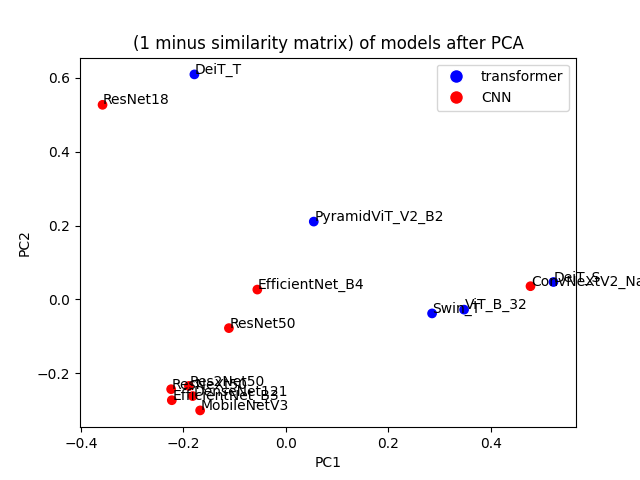
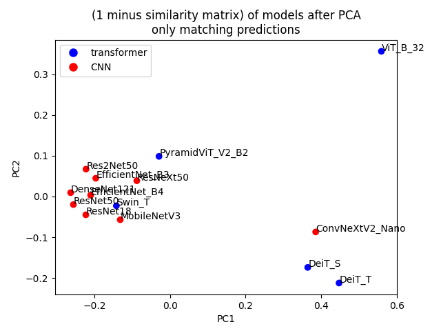
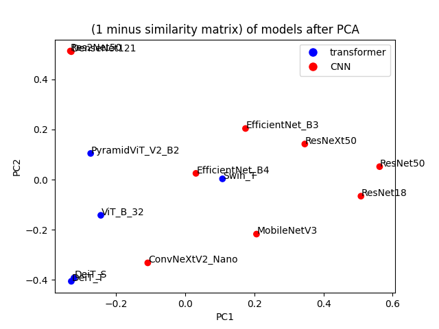

# Results

Here I document all experiments.

### ToC:

- [20240410-gradcam-256](#20240410-gradcam-256)
- [20240410-gradcam-1024](#20240410-gradcam-1024)
- [20240410-kernelshap-64](#20240410-kernelshap-64)
- [20240414-1-2x2-pca-comparison](#20240414-1-2x2-pca-comparison)
- [20240414-2-gradcam-1024-fixed-efficientnet-b4](#20240414-2-gradcam-1024-fixed-efficientnet-b4)
- [20240414-3-2x2-pca-comparison-fixed-efficientnet-b4](#20240414-3-2x2-pca-comparison-fixed-efficientnet-b4)
- [20240417-gradcam-256-only-same-prediction](#20240417-gradcam-256-only-same-prediction)

## 20240410-gradcam-256

Settings:
- Models: ['DeiT_S', 'DeiT_T', 'DenseNet121', 'EfficientNet_B3', 'EfficientNet_B4', 'ConvNeXtV2_Nano', 'PyramidViT_V2_B2', 'MobileNetV3', 'Swin_T', 'ResNet18', 'ResNet50', 'ResNeXt50', 'Res2Net50', 'ViT_B_32']
- Method: GradCAM
- Images: 16 batches by 16 images, 256 total

Took 150s with T4 Colab GPU.

Results:

Cosine similarity + PCA | RBF similarity + PCA
:-------------------------:|:-------------------------:
  |  

Clusters:
- DenseNet121, EfficientNet_B3, PyramidViT_V2_B2, MobileNetV3, Swin_T, ResNet18, ResNet50, ResNeXt50, Res2Net50,
- ConvNeXtV2_Nano, DeiT_S, DeiT_T, ViT_B_32,
- EfficientNet_B4 

Note: EfficientNet_B4 behaves strangely - almost all explanations highlight top right corner. Could be somewhat fixed by replacing it with an average. See below for a visualized example of this bug.

## 20240410-gradcam-1024

Settings:
- Models: ['DeiT_S', 'DeiT_T', 'DenseNet121', 'EfficientNet_B3', 'EfficientNet_B4', 'ConvNeXtV2_Nano', 'PyramidViT_V2_B2', 'MobileNetV3', 'Swin_T', 'ResNet18', 'ResNet50', 'ResNeXt50', 'Res2Net50', 'ViT_B_32']
- Method: GradCAM
- Images: 32 batches by 32 images, 1024 total

Took 520s with T4 Colab GPU.

Results:

Cosine similarity + PCA | RBF similarity + PCA
:-------------------------:|:-------------------------:
  |  

Clusters - Same as 20240410-gradcam-256 (for 256 instead of 1024 analyzed images).

Note: EfficientNet_B4 behaves strangely - same as above, almost all explanations highlight top right corner. Could be somewhat fixed by replacing it with an average.

Good - some CNN (EfficientNet_B3) | Bad - EfficientNet_B4 (CNN)
:-------------------------:|:-------------------------:
  |  

## 20240410-kernelshap-64

Settings:
- Models: ['DeiT_S', 'DeiT_T', 'DenseNet121', 'EfficientNet_B3', 'EfficientNet_B4', 'ConvNeXtV2_Nano', 'PyramidViT_V2_B2', 'MobileNetV3', 'Swin_T', 'ResNet18', 'ResNet50', 'ResNeXt50', 'Res2Net50', 'ViT_B_32']
- Method: KernelSHAP
- Images: 4 batches by 16 images, 64 total

Took 1550s with T4 Colab GPU.

Results:

Cosine similarity + PCA | RBF similarity + PCA
:-------------------------:|:-------------------------:
  |  

Clusters:
- ConvNeXtV2_Nano, DeiT_S, DeiT_T, EfficientNet_B4, PyramidViT_V2_B2, Swin_T, ResNet18, Res2Net50, ViT_B_32,
- EfficientNet_B3, MobileNetV3, ResNet50
- DenseNet121, ResNeXt50

Note: Explanations generally look bland. Possibly, changing KernelSHAP settings (64 segments and sampled 100 times) to increase how many times the superpixels are sampled, would improve the results. Obviously, segmentation is not perfect too and is an additional variable.

Good explanation | Bad explanation
:-------------------------:|:-------------------------:
  |  

## 20240414-1-2x2-pca-comparison

Take PCA plots from `20240410-gradcam-1024` and `20240410-kernelshap-64` for cosine and RBF similarity and plot them side by side:

## 20240414-2-gradcam-1024-fixed-efficientnet-b4

Settings - rerun `20240410-gradcam-1024` for EfficientNet_B4 only after fix.

Fix: replace top-right corner with an average of other pixels.

Results: extreme value from top-right corner has been removed for all explanations -> 

Before fix | After fix
:-------------------------:|:-------------------------:
 | 

## 20240414-3-2x2-pca-comparison-fixed-efficientnet-b4

Goal: repeat `20240414-1-2x2-pca-comparison` with fixed EfficientNet_B4.

## 20240417-gradcam-256-only-same-prediction

Goal: 

- count the number of images on which a given pair of models gave the same prediction (not necessarily correct, but the same),
- compute similarity matrices for cosine and rbf but using only images for which a given pair of models gave the same prediction,
- compute similarity between this matrix of counts of same predictions and all similarity matrices from earlier.

Setting:

- as in `20240410-gradcam-256`, but for 8 batches of 32 images, same 256 total.

Took 300s with T4 GPU on Colab.

### Results:

Correlations between a matrix of count of same predictions and different similarity matrices (rbf/cosine and using [all/only matching] predictions):

|               | All images | Only matching predictions |
|---------------|------------|---------------------------|
| Cosine        | 0.695880   | 0.672233                  |
| RBF           | 0.642113   | 0.641272                  |

Counts heatmap: 

Similarity matrices that it was compared to:

|               | All images | Only images with matching prediction |
|---------------|--------|-----|
| Cosine        |  |  |
| RBF           |  |  |

PCA obtained for these similarity matrices:

|               | All images | Only images with matching prediction |
|---------------|--------|-----|
| Cosine        |  |  |
| RBF           |  |  |
